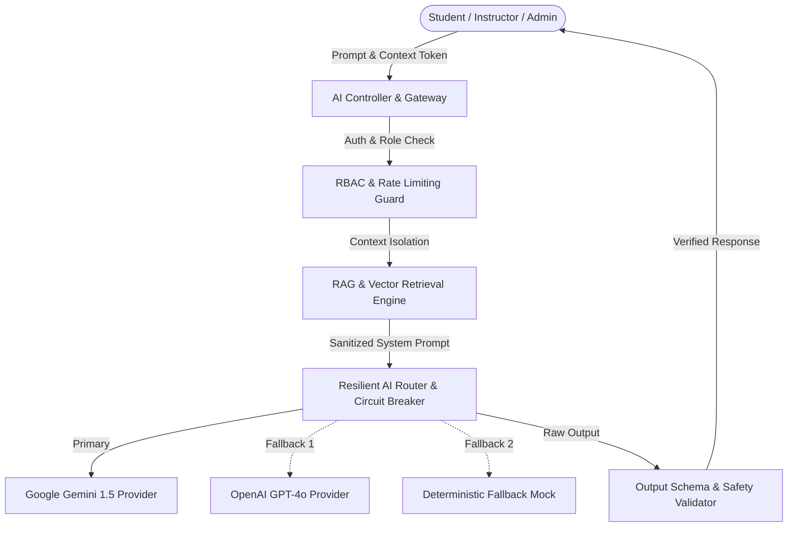

# AI Learning Intelligence Architecture

## 1. Modular AI Layer Overview
The platform's AI ecosystem operates as an assistive, guardrailed copilot layer rather than an autonomous decision-maker. It is structured into clear functional domains located within `apps/backend/src/services/ai/`.

---

## 2. Core Components

1. **Provider Abstraction (`aiRouter.js`)**:
   - Manages model switching across Google Gemini (`gemini-1.5-flash`), OpenAI (`gpt-4o`), and resilient mock fallback.
   - Built-in 3-strike circuit breaker with a 60-second cooldown timer.
2. **AI Tool Registry (`aiToolRegistry.js`)**:
   - Strict server-side permission registry. Tools can only read authorized student data (`getStudentProgress`, `getSkillProfile`, `searchJobs`).
   - Tools are barred from destructive mutations (cannot delete accounts, issue refunds, alter course states, or tamper with grades).
3. **Retrieval-Augmented Generation (RAG)**:
   - Chunked document indexing in `vectorChunk.model.js`.
   - Filters retrieved chunks strictly by student enrollment and tenant boundaries, preventing cross-student and cross-organization context leakage.
4. **Safety & Guardrails**:
   - Prompt injection containment: Retrieved content is treated strictly as raw data rather than executable instructions.
   - Grounded explanations: When information is missing, the assistant outputs `"I don't have enough information"` instead of hallucinating.
