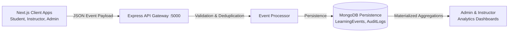

# Product Analytics & Event Tracking Architecture

## 1. Pipeline Overview
The platform employs a centralized, privacy-compliant event tracking architecture. Events originate across the Student, Instructor, and Admin frontends, flow through authenticated backend endpoints, and are aggregated into operational models (`LearningEvent`, `AuditLog`) for dashboard consumption.



---

## 2. Standardized Event Schema (`v1`)

```json
{
  "eventId": "evt_uuid_v4",
  "eventName": "LESSON_COMPLETED",
  "schemaVersion": "v1",
  "userId": "64f123abc456...",
  "role": "STUDENT",
  "organizationId": null,
  "timestamp": "2026-09-18T00:15:00.000Z",
  "page": "/courses/react-mastery/lesson-2",
  "metadata": {
    "courseId": "64f999...",
    "lessonId": "64faaa...",
    "timeSpentSeconds": 240,
    "completed": true
  }
}
```

---

## 3. Core Event Categories & Taxonomy

| Category | Event Names | Primary Purpose |
| :--- | :--- | :--- |
| **Learning** | `LESSON_STARTED`, `LESSON_COMPLETED`, `COURSE_ENROLLED`, `RESOURCE_VIEWED` | Tracking learning velocity, drop-offs, and completion rates |
| **Assessment** | `QUIZ_STARTED`, `QUIZ_SUBMITTED`, `DIAGNOSTIC_COMPLETED` | Scoring analysis, mistake categorizations, knowledge gap discovery |
| **Coding** | `CODING_ATTEMPTED`, `CODING_SOLVED` | Algorithmic fluency metrics, test case pass rates |
| **Career** | `JOB_VIEWED`, `JOB_APPLIED`, `RESUME_UPDATED`, `INTERVIEW_SESSION` | Job funnel conversion, ATS resume builder effectiveness |
| **Instructor** | `COURSE_CREATED`, `LESSON_PUBLISHED`, `ANALYTICS_VIEWED` | Content authoring velocity, educator engagement |
| **Admin** | `USER_SUSPENDED`, `COURSE_APPROVED`, `SECURITY_EVENT_REVIEWED` | Platform governance, audit trail verification |
| **AI Telemetry**| `AI_PROMPT_SENT`, `AI_FALLBACK_TRIGGERED`, `AI_FEEDBACK_RECEIVED`| LLM latency tracking, circuit breaker events, helpfulness scoring |

---

## 4. Privacy, Deduplication & Data Retention
1. **Data Minimization**: Passwords, raw sensitive prompts, and student PII are explicitly barred from analytics payloads.
2. **Deduplication**: Events enforce unique compound indexing (`{ studentId: 1, eventId: 1 }` or sliding window deduplication) to prevent double counting on network retries.
3. **Retention**: Granular raw learning events are retained for 90 days; daily aggregated materialized metrics are retained indefinitely for longitudinal reporting.
