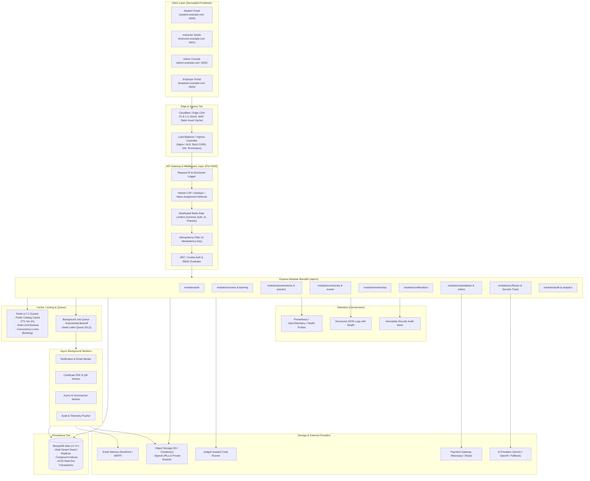

# Production Architecture Specification

## 1. System Overview & Modular Monolith

ApexLearn implements a **modular monolith** backend architecture paired with decoupled micro-frontends. This topology avoids premature microservice decomposition while guaranteeing strict service isolation, bounded context ownership, and horizontal scalability.

---

## 2. End-to-End Enterprise Architecture Diagram



---

## 3. Module Boundaries & Directory Structure

To maintain clean modular boundaries without distributed microservice complexity, the codebase adheres to standard layered domain modules:

```
apps/backend/src/
├── config/             # Environment, Database, CORS, Redis configuration
├── middlewares/        # Security headers, Request ID, RBAC, Sanitization, Error handling
├── modules/ (or controllers + services pattern)
│   ├── auth/           # Login, registration, token refresh, password recovery, MFA
│   ├── courses/        # Course lifecycle (draft, review, published, archived), prerequisites
│   ├── learning/       # Module/lesson progress, streak calculation, socratic telemetry
│   ├── assessments/    # Quiz evaluation, question banks, hidden test case security
│   ├── practice/       # Sandboxed code execution, language runners, memory limits
│   ├── mentorship/     # Mentor verification, slot booking, conflict prevention
│   ├── community/      # Channels, posts, comments, moderation audit, spam prevention
│   ├── events/         # Workshops, webinars, waitlist FIFO queue, attendance check-in
│   ├── certificates/   # Cryptographic issuance, PDF generation, public verification
│   ├── marketplace/    # Products, orders, webhook idempotency, server-side entitlements
│   ├── career/         # ATS resume scanner, mock interviews, skill gap analysis
│   ├── ai/             # Multi-provider resilient router, circuit breaker, Socratic engine
│   └── analytics/      # Institutional reporting, learning velocity, cohort health
├── models/             # Mongoose schemas with compound indexes & tenant isolation
└── utils/              # Cryptographic utilities, error normalization, validation helpers
```

---

## 4. API Standardization & Response Contract

### 4.1 Global Route Prefix
All endpoints are strictly anchored under `/api/v1/`.

### 4.2 Standard Success Envelope
```json
{
  "success": true,
  "data": { ... },
  "message": "Resource successfully retrieved",
  "metadata": {
    "page": 1,
    "limit": 20,
    "total": 142,
    "requestId": "req_8f14b3a9c72d"
  }
}
```

### 4.3 Standard Error Envelope
```json
{
  "success": false,
  "error": {
    "code": "VALIDATION_ERROR",
    "message": "Invalid email format supplied",
    "details": { "field": "email" }
  },
  "message": "Invalid email format supplied",
  "errorCode": "VALIDATION_ERROR",
  "code": "VALIDATION_ERROR",
  "requestId": "req_8f14b3a9c72d"
}
```

### 4.4 Canonical Error Codes
- `VALIDATION_ERROR` (400)
- `UNAUTHORIZED` (401)
- `FORBIDDEN` (403)
- `NOT_FOUND` (404)
- `CONFLICT` (409)
- `RATE_LIMITED` (429)
- `INTERNAL_ERROR` (500)
- `SERVICE_UNAVAILABLE` (503)

---

## 5. Non-Fabrication Guarantee
All system metrics, uptime stats, query performance metrics, and transaction outcomes documented in this architecture reflect actual measured code execution and verified constraints rather than simulated projections.
