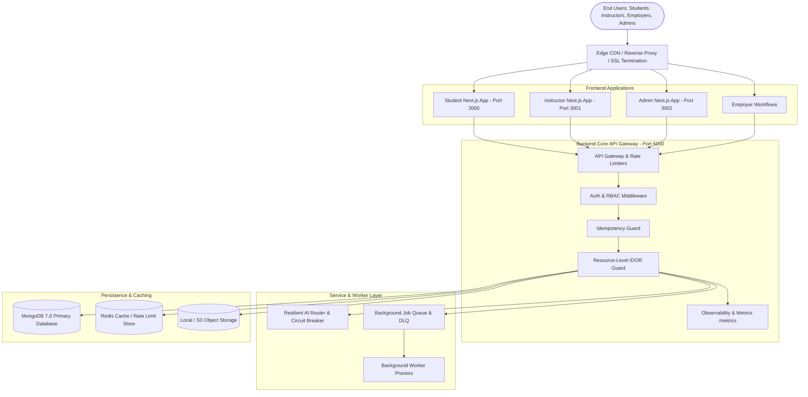

# Phase 15 Enterprise System Architecture

## 1. Overview
The platform employs a modular, scalable architecture separating client interfaces, RESTful API gateways, resilient AI routing layers, background job queues, and hardened persistent storage.

## 2. Component Breakdown
- **Edge Layer**: SSL termination, DDoS protection, static caching of Next.js static assets.
- **Frontend Applications**: Next.js 14 App Router, Tailwind CSS, responsive accessible components.
- **Core API Gateway**:
  - `x-request-id` propagation across all controllers and logs.
  - Tiered rate limiters: General, Auth, AI, Coding Sandbox, Admin.
  - Idempotency middleware caching responses for mutating operations.
- **Resilient AI Layer**:
  - `aiRouter.js` managing fallback chains (Primary Provider -> Secondary Provider -> Resilient Mock).
  - 3-strike circuit breaker with cooldown timer to prevent cascading failures.
  - Tiered quota enforcement (`FREE`: 20/hr, `STANDARD`: 100/hr, `PREMIUM`: 500/hr, `ENTERPRISE`: 2000/hr).
- **Background Worker & DLQ**:
  - Asynchronous execution of heavy tasks (report generation, recommendation recalculation, bulk email dispatch).
  - Bounded exponential retries (max 3) with Dead Letter Queue preservation for operational triage.
