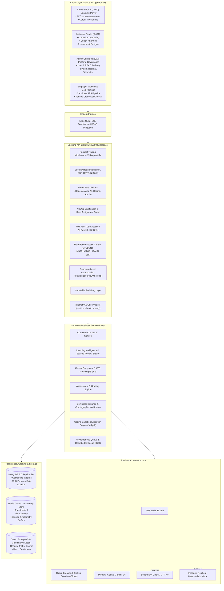

# Phase 17 Enterprise System Architecture

## 1. Executive Summary & Topology
The platform employs a modular, decoupled, and highly observable architecture separating multi-role client portals (Student, Instructor, Admin, and Employer), a unified RESTful API Gateway with strict RBAC/IDOR controls, a resilient multi-provider AI routing layer with circuit breaker protections, asynchronous job workers with Dead Letter Queues (DLQ), and persistent storage backed by MongoDB 7.0 and Redis.

---

## 2. Core Service Boundaries

| Service Domain | Primary Responsibility | Associated Models |
| :--- | :--- | :--- |
| **Authentication & IAM** | Credential validation, JWT issuance, password reset, rate-limited auth | `User`, `RefreshToken` |
| **Course & Curriculum** | Catalog browsing, module/lesson hierarchy, enrollment tracking, video player | `Course`, `Module`, `Lesson`, `Enrollment`, `Progress` |
| **Learning Intelligence** | Diagnostic assessments, knowledge gap tracking, spaced review scheduling, cohort analytics | `DiagnosticAttempt`, `SpacedReview`, `LearningProfile`, `Cohort` |
| **Career & ATS Pipeline** | Job board, career pathing, automated resume builder, application tracking | `Job`, `JobApplication`, `Resume`, `CareerProfile`, `Company` |
| **Assessment & Grading** | Quiz/exam attempts, automated scoring, mistake tracking | `Assessment`, `AssessmentAttempt`, `Question`, `Mistake` |
| **Coding Sandbox** | Safe source code execution, test-case verification, execution quota enforcement | `Problem`, `Submission`, `TestCase` |
| **AI Intelligence & RAG** | AI tutor chat, contextual vector embeddings, prompt templating, cost governance | `AIConversation`, `AIMessage`, `VectorChunk` |
| **Governance & Operations** | Immutable audit logs, platform settings, health checks, data quality diagnostics | `AuditLog`, `PlatformSetting`, `FeatureFlag`, `SupportTicket` |

---

## 3. Data Protection & Security Controls
1. **NoSQL Injection Defense**: Recursive sanitization middleware strips MongoDB query operators (`$`, `.`) from client request bodies and query parameters.
2. **Mass Assignment Prevention**: Middleware strips privileged attributes (`role`, `permissions`, `isSuperAdmin`, `publishedBy`, `resetPasswordToken`) from mutating requests sent by non-administrators.
3. **IDOR Defense**: All mutating and sensitive reads verify server-side resource ownership via `requireCourseOwnership` and `requireStudentResourceOwnership`.
4. **Tenant Isolation**: Multi-tenant organizations enforce strict boundaries on jobs, cohorts, reports, and administrative data sets.
5. **CORS & Headers**: Strict CORS origin whitelisting paired with Helmet CSP, HSTS, frameguard (`DENY`), and cross-origin resource policies.

---

## 4. Resilience, Observability & Fault Tolerance
1. **Graceful Shutdown**: Server captures `SIGINT` and `SIGTERM`, halts HTTP listeners, allows in-flight safe requests up to 10 seconds to finish, and closes MongoDB connections cleanly.
2. **Probes**:
   - `/health`: Fast liveness verification for orchestrators.
   - `/ready`: Verifies database readiness (MongoDB connection state `1`). Returns HTTP 503 if disconnected.
   - `/metrics`: System metrics (request count, status distributions, latency snapshots).
3. **Structured Logging**: Unified request log containing timestamp, `requestId`, HTTP method, route, duration, status, and client IP hash. Sensitive secrets and passwords are completely excluded from logs.
