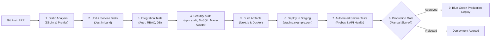

# Continuous Integration & Continuous Deployment (CI/CD) Pipeline

## 1. Overview
ApexLearn utilizes an automated CI/CD pipeline ensuring that all code committed to the repository is linted, rigorously tested across unit/integration/security suites, built into immutable artifacts, and deployed with zero downtime.

---

## 2. Pipeline Stages & Workflow



---

## 3. Branching Strategy

| Branch | Purpose | Deployment Target | Access Control |
| :--- | :--- | :--- | :--- |
| `main` | Production releases | Production environment (`https://*.example.com`) | Protected; requires PR review, passing CI, and senior approval |
| `develop` | Integration and staging | Staging environment (`https://staging-*.example.com`) | Protected; requires PR review and passing CI |
| `feature/*` | Feature development | Ephemeral preview environments | Developer working branches |
| `hotfix/*` | Urgent production fixes | Staging -> Production | Fast-track PR with security lead review |

---

## 4. Pull Request Gate Requirements

Every pull request targeting `develop` or `main` must strictly pass all checks before merge approval:
1. **ESLint & Format Check**: `npm run lint` with 0 warnings/errors.
2. **Backend Regression Test Suite**: `npm run test:backend` passing all 26 test suites (266 tests, 100% pass rate).
3. **Dependency Security Scan**: `npm audit --production` with 0 critical or high vulnerabilities.
4. **Build Verification**:
   - `npm run build --workspace=apps/student`
   - `npm run build --workspace=apps/instructor`
   - `npm run build --workspace=apps/admin`
   - `docker build -t apexlearn-backend:test .`
5. **Contract Compatibility**: Verification of `/api/v1/` contract compatibility.

---

## 5. Sample GitHub Actions Workflow Definition (`.github/workflows/ci-cd.yml`)

```yaml
name: ApexLearn CI/CD Pipeline

on:
  push:
    branches: [main, develop]
  pull_request:
    branches: [main, develop]

jobs:
  lint-and-test:
    runs-on: ubuntu-latest
    services:
      mongodb:
        image: mongo:7.0
        ports:
          - 27017:27017
      redis:
        image: redis:7.2-alpine
        ports:
          - 6379:6379

    steps:
      - name: Checkout Code
        uses: actions/checkout@v4

      - name: Setup Node.js
        uses: actions/setup-node@v4
        with:
          node-version: '20'
          cache: 'npm'

      - name: Install Dependencies
        run: npm ci

      - name: Run ESLint
        run: npm run lint

      - name: Execute Backend Tests
        env:
          NODE_ENV: test
          MONGODB_URI: mongodb://localhost:27017/edtech_platform_test
          REDIS_URL: redis://localhost:6379
          JWT_SECRET: test_ci_jwt_secret_min_32_characters_string
          JWT_REFRESH_SECRET: test_ci_refresh_jwt_secret_min_32_characters
        run: npm run test:backend

      - name: Run Dependency Vulnerability Scan
        run: npm audit --audit-level=high

      - name: Build Applications
        run: npm run build

  deploy-staging:
    needs: lint-and-test
    if: github.ref == 'refs/heads/develop'
    runs-on: ubuntu-latest
    environment: staging
    steps:
      - name: Deploy to Staging Cluster
        run: echo "Deploying commit ${{ github.sha }} to Staging"

  deploy-production:
    needs: lint-and-test
    if: github.ref == 'refs/heads/main'
    runs-on: ubuntu-latest
    environment: production
    steps:
      - name: Deploy to Production Cluster
        run: echo "Deploying commit ${{ github.sha }} to Production Blue-Green Fleet"
```
