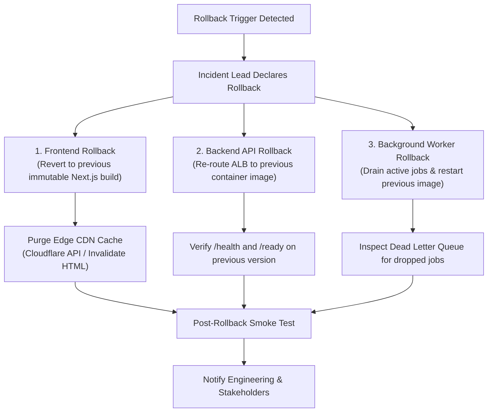

# Production Rollback Runbook & Procedures

## 1. Overview
This runbook details step-by-step instructions for executing an emergency rollback of ApexLearn applications, backend APIs, database states, and background workers in the event of an unrecoverable production regression.

---

## 2. Emergency Rollback Triggers

Initiate immediate rollback under any of the following conditions:
1. **Critical Authentication Failure**: Users unable to log in, refresh tokens, or authenticate across portals.
2. **Elevated Error Budget Depletion**: HTTP 5xx errors exceed **1.0%** of total requests over 3 consecutive minutes.
3. **Severe Latency Regression**: API response latency $p95$ exceeds **1,000ms** on core endpoints.
4. **Data Corruption or IDOR Vulnerability**: Unauthorized multi-tenant data disclosure or inconsistent database writes detected.
5. **Database Deadlock / Connection Starvation**: MongoDB connection pool exhausted with `/ready` returning 503.

---

## 3. Rollback Action Matrix



---

## 4. Detailed Step-by-Step Rollback Procedures

### Step 1: Re-route Ingress / Backend Container Fleet
Switch traffic on the Application Load Balancer to the previous known-good container image tag:
```bash
# AWS ECS CLI Example:
aws ecs update-service \
  --cluster apexlearn-production \
  --service api-gateway \
  --task-definition apexlearn-api:PREVIOUS_STABLE_REVISION

# Kubernetes / Helm Example:
helm rollback apexlearn-backend 
```

### Step 2: Roll Back Frontend Deployments
Re-deploy the previous successful deployment on Vercel / Cloudflare Pages / Static Hosting:
```bash
# Vercel Deployment Rollback
vercel rollback <PREVIOUS_DEPLOYMENT_URL> --scope apexlearn --yes
```

### Step 3: Edge CDN Cache Invalidation
Purge cached HTML documents and dynamic API routes to prevent clients from executing mismatched JavaScript chunk hashes:
```bash
# Invalidate CDN cache
curl -X POST "https://api.cloudflare.com/client/v4/zones/${CLOUDFLARE_ZONE_ID}/purge_cache" \
  -H "Authorization: Bearer ${CF_PURGE_TOKEN}" \
  -H "Content-Type: application/json" \
  --data '{"purge_everything":true}'
```

### Step 4: Background Worker Drain & Reversion
1. Pause queue consumption on the new image.
2. Deploy the previous worker image tag.
3. Resume queue processing and inspect any failed tasks in the Dead Letter Queue (`DLQ`).

### Step 5: Database Backward Compatibility (Zero Data Loss)
- All schema changes must follow the **Expand-Contract** pattern.
- Columns/fields added in the failing release are left in place without deletion, ensuring the previous code version continues reading existing data without errors.
- Never execute destructive `db.collection.drop()` or drop fields during an active deployment.

---

## 5. Post-Rollback Validation Checklist

- [ ] `curl -fsS https://api.example.com/health` returns `{"status":"ok"}`.
- [ ] `curl -fsS https://api.example.com/ready` returns `{"database":"connected"}`.
- [ ] Student login and dashboard load successfully.
- [ ] Instructor course catalog loads successfully.
- [ ] Admin console access verified without authorization errors.
- [ ] Error rate on Grafana/APM dashboard drops below 0.1%.
- [ ] Postmortem incident response ticket filed within 24 hours.
