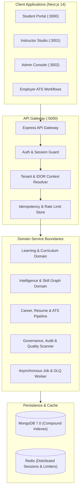

# Enterprise Scale & Platform Extensibility Architecture

## 1. Modular Monolith Architecture
The platform intentionally employs a **Modular Monolith** architecture over premature microservices. This provides enterprise-grade scalability, simple continuous delivery, zero network latency overhead between domain services, and bulletproof transactional integrity.

---

## 2. Horizontal Scaling & Stateless API Gateway
1. **Stateless HTTP Layer**: Sessions are anchored in short-lived cryptographic JWTs and Redis distributed session stores. Any backend instance can handle any client request behind a standard Layer 7 load balancer (Nginx / AWS ALB).
2. **Distributed Rate Limiting**: Tiered rate limiters utilize Redis key expiration for shared token buckets across multi-instance clusters.
3. **Database Connection Pooling**: Mongoose connection pooling is tuned with `maxPoolSize: 50` and automatic connection reuse, avoiding per-request connection overhead.

---

## 3. Asynchronous Job Processing & Dead Letter Queues
- Long-running tasks (curriculum report generation, cohort velocity re-indexing, AI evaluations, email dispatches) are offloaded to background job processors.
- Jobs implement bounded exponential backoff (maximum 3 retries). Poison pill tasks automatically transition to the Dead Letter Queue (DLQ) for administrative triage.
