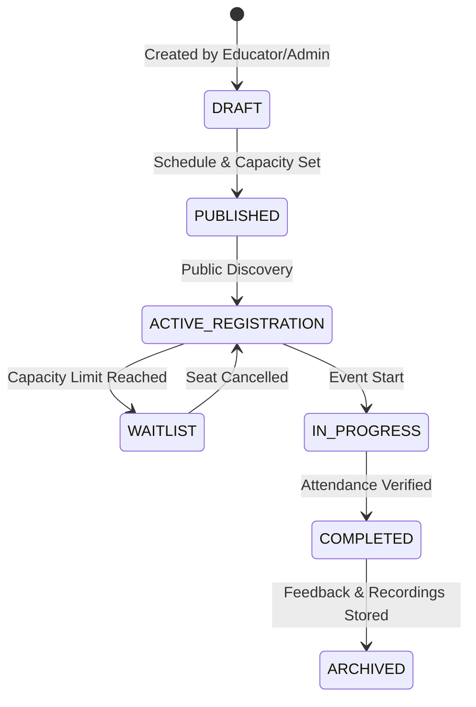

# Platform Event & Calendar Architecture

## 1. Overview
The Event system supports structured synchronous learning experiences, including technical workshops, webinars, hackathons, and guest lectures hosted by instructors, employers, and administrators.

---

## 2. Event Lifecycle & Capacity Management

---

## 3. Key Operational Rules
1. **Attendance Integrity**:
   - Registration does not equal verified attendance. Attendance is marked server-side via attendance tokens or session check-ins.
2. **Timezone Awareness**:
   - All events store canonical UTC timestamps while rendering localized times based on student browser headers or user profile preferences.
3. **Idempotent Reminders**:
   - Automated reminder jobs (24h before, 1h before) enforce idempotency checks to prevent duplicate notification dispatches on worker retries.
