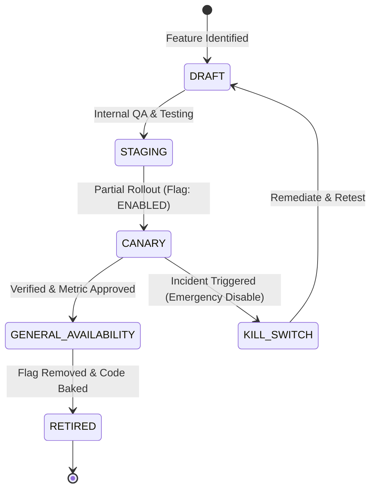

# Safe Experimentation & Feature Flag Architecture

## 1. Feature Flag Lifecycle
The platform provides a centralized, dynamic feature flag system backed by the `FeatureFlag` model and `admin.controller.js`. Flags allow engineering and product teams to safely test, stage, and roll out features without redeploying code.

---

## 2. Active Feature Flag Registry

| Flag Key | Description | Default State | Environment Scope | Emergency Kill Switch |
| :--- | :--- | :--- | :--- | :--- |
| `AI_TUTOR_V2` | Enables multi-turn Socratic dialogue and teach-back comprehension prompts. | `ENABLED` | ALL | Supported (`/api/v1/admin/feature-flags/AI_TUTOR_V2`) |
| `SPACED_REPETITION_MISTAKES` | Surfaces automated flashcard recall prompts for prior assessment mistakes. | `ENABLED` | ALL | Supported |
| `ATS_RESUME_PARSER` | AI-assisted ATS resume scoring and keyword gap analysis. | `ENABLED` | ALL | Supported |
| `INSTITUTIONAL_COHORTS` | Multi-student cohort management and velocity analytics for educators. | `ENABLED` | ALL | Supported |
| `JUDGE0_EXECUTION_SANDBOX` | External code runner API for multi-language execution. | `DISABLED` (local runner active) | PRODUCTION | Supported |

---

## 3. Experimentation & Safety Standards
1. **Hypothesis & Metric Requirement**: Every A/B test or dark launch must declare:
   - Primary metric (e.g. Lesson completion rate, Assessment retry count).
   - Target user population (percentage-based or role-specific).
   - Rollback criteria (error rate threshold > 1% immediately triggers flag disabling).
2. **Audited Toggles**: All mutations to feature flag states are recorded in `AuditLog` with the admin user ID, timestamp, and previous state.
