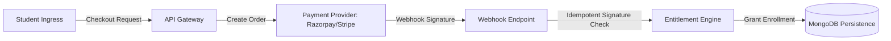

# Learning Marketplace & Entitlement Architecture

## 1. Overview
The marketplace architecture governs access, purchasing, and creator compensation for paid curricula, intensive mentorship slots, and specialized workshops.

---

## 2. Security & Transactional Guarantees
1. **Server-Side Entitlement Resolution**:
   - Access to premium materials is never granted based on client-side status flags.
   - Entitlements are created strictly after validating trusted server-side webhook signatures.
2. **Order Idempotency**:
   - Webhook processing deduplicates incoming event IDs (`idempotency.middleware.js`) to prevent duplicate enrollments or double billing on retries.
3. **Transparent Financial Reporting**:
   - Instructor payouts display real recorded transactions (Gross, Platform Fee, Net).
   - Zero fabricated revenue or fake enrollment metrics are ever generated.
