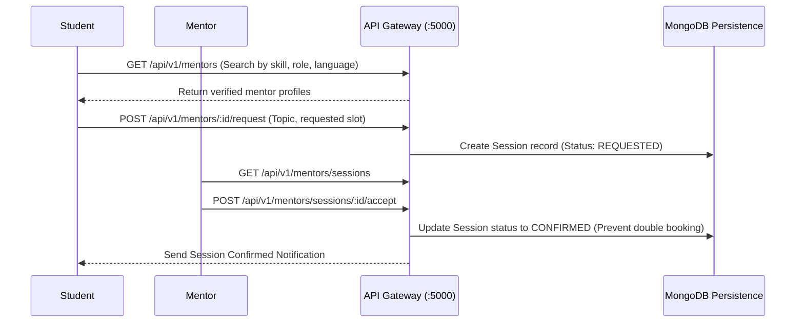

# Mentorship System & Session Architecture

## 1. Overview
The Mentorship ecosystem connects students seeking career guidance, code reviews, and mock interviews with verified industry practitioners and instructors.

---

## 2. Core Policies & Security Constraints

1. **Verification Status**:
   - Mentors undergo administrative vetting (`PENDING` -> `VERIFIED` -> `SUSPENDED`).
   - Unverified mentors are excluded from public student discovery.
2. **Double-Booking Defense**:
   - Server-side slot reservation checks prevent overlapping confirmed bookings for any mentor.
3. **Privacy of Session Notes**:
   - Mentors maintain private evaluation notes (`mentorNotes`) that are strictly omitted from student-facing payloads.
   - Students maintain their own personal action notes (`studentNotes`).
4. **Safety & Moderation**:
   - Both parties can flag inappropriate sessions or block users via `/api/v1/mentors/report`.
