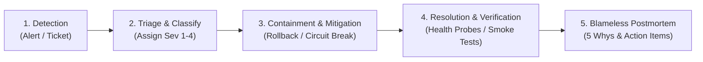

# Incident Response & Management Playbook

## 1. Incident Severity Definitions

| Severity | Classification | Description | Response SLA | Target Resolution |
| :--- | :--- | :--- | :--- | :--- |
| **Sev-1 (P0)** | Critical Outage | Core service completely down (API unreachable, DB crash, auth broken, data leak). | < 15 minutes | < 2 hours |
| **Sev-2 (P1)** | High Impact | Core workflow broken for multiple users (cannot submit exams, enroll, or stream lessons). | < 30 minutes | < 4 hours |
| **Sev-3 (P2)** | Medium Impact | Non-critical feature degraded (AI tutor slow, analytics delay, avatar upload error). | < 2 hours | < 24 hours |
| **Sev-4 (P3)** | Low Impact | Minor UI cosmetic glitch, documentation typo, non-blocking bug. | < 24 hours | Next release |

---

## 2. Incident Response Lifecycle



### Step 1: Detection & Alerting
- Health checks return status `NOT_READY` or 503 via `/ready`.
- Error rate in `/metrics` exceeds 1% threshold over a 5-minute rolling window.
- Automated PagerDuty alert triggered to on-call incident commander.

### Step 2: Triage & Communication
- Incident Commander (Lead On-Call Engineer) acknowledges alert within 15 minutes.
- Create dedicated incident channel: `#incident-<YYYYMMDD>-<summary>`.
- Publish initial status page notice to users within 20 minutes for Sev-1 / Sev-2 events.

### Step 3: Containment & Mitigation
- **Rollback Option**: If incident followed a recent deployment, immediately execute [Production Rollback Runbook](../deployment/rollback.md).
- **Circuit Breaking**: If external integration (AI provider, email, payment gateway) is failing, engage circuit breaker to route to cached responses or degraded mode.
- **Database Failover**: If MongoDB primary is unresponsive, trigger automated replica step-down.

### Step 4: Resolution & Verification
- Verify health probes: `GET /health`, `GET /ready`, `GET /live`.
- Run automated read smoke tests on Student, Instructor, and Admin portals.
- Confirm APM error rates return to baseline (< 0.1%).

### Step 5: Blameless Postmortem Template
Every Sev-1 and Sev-2 incident requires a documented postmortem within 48 hours:

```markdown
# Incident Postmortem: [Title]
**Date**: [YYYY-MM-DD]
**Severity**: [Sev-1 / Sev-2]
**Incident Commander**: [Name]
**Duration**: [X hours Y minutes]

## 1. Executive Summary
Brief non-technical description of the incident, impact, and final resolution.

## 2. Impact Analysis
- Total downtime / degraded duration: [Duration]
- Affected user accounts / organizations: [Count]
- Failed transactions or submissions: [Count]

## 3. Timeline (UTC)
- HH:MM - Anomaly detected by alert [AlertName]
- HH:MM - Incident Commander acknowledged
- HH:MM - Root cause identified
- HH:MM - Mitigation applied (e.g. rollback / failover)
- HH:MM - System confirmed restored and verified

## 4. Root Cause Analysis (5 Whys)
1. Why: ...
2. Why: ...
3. Why: ...
4. Why: ...
5. Why: ...

## 5. Preventative Action Items
| Action Item | Type | Owner | Target Date | Jira / Issue |
| :--- | :--- | :--- | :--- | :--- |
| Add compound index on table | Preventative | Engineer A | YYYY-MM-DD | APEX-101 |
| Adjust rate limit threshold | Mitigation | Engineer B | YYYY-MM-DD | APEX-102 |
```
