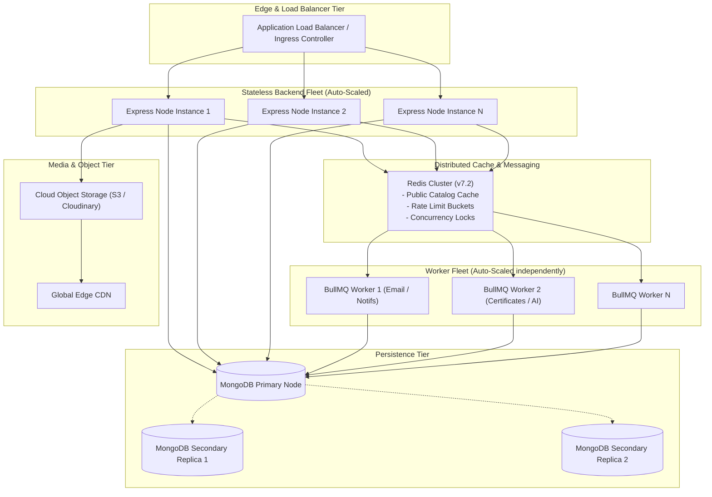

# Enterprise Horizontal Scaling & Capacity Strategy

## 1. Overview
ApexLearn achieves scalability by maintaining a **stateless backend API tier**, offloading static/media assets to an Edge CDN and Object Storage, and decoupling background workloads via Redis-backed job queues.

---

## 2. Tier-by-Tier Scaling Model

---

## 3. Stateless Backend Scaling Rules

1. **Zero Local File Dependency**: No session state, uploaded files, or transient caches are stored on the local file system. All uploaded artifacts are piped directly to Object Storage.
2. **Stateless JWT & Refresh Tokens**: Authentication state is validated via cryptographic signatures and database/Redis refresh token lookups.
3. **Auto-Scaling Metrics**:
   - **Scale Out**: CPU utilization > 70% OR HTTP request queue latency > 200ms over a 3-minute sustained window.
   - **Scale In**: CPU utilization < 25% over a 15-minute cooldown period.

---

## 4. Redis Caching & Eviction Policies

| Cache Domain | Key Pattern | TTL | Eviction Policy | Security Boundary |
| :--- | :--- | :--- | :--- | :--- |
| **Public Course Metadata** | `cache:course:public:<courseId>` | 30 Minutes | `volatile-lru` | Public catalog only |
| **Course Category Summary** | `cache:courses:categories` | 1 Hour | `volatile-lru` | Public metadata |
| **Rate Limit Counters** | `ratelimit:<tier>:<ip_or_user>` | 1 Minute - 15m | `volatile-ttl` | Transient bucket |
| **Session Concurrency Lock**| `lock:session:mentor:<slotId>` | 30 Seconds | `volatile-ttl` | Concurrency lock |

> [!CAUTION]
> **Strict Privacy Rule**: Never cache private student submissions, grades, resumes, direct messages, or multi-tenant enterprise data in global Redis keys.

---

## 5. Background Worker Scaling

1. **Independent Process Isolation**: Background workers run in separate container pods from user-facing HTTP request listeners.
2. **Queue Backlog Scaling**: Worker instances scale based on BullMQ backlog count (1 worker per 500 queued jobs).
3. **Graceful Job Shutdown**: Workers listen for `SIGTERM`, cease picking up new jobs, and allow active jobs up to 45 seconds to finish before graceful termination.

---

## 6. Database Scaling & Read Splitting

1. **Read Preference**: Read operations on non-critical historical queries (e.g. analytics aggregates, past course reviews) utilize `readPreference: 'secondaryPreferred'`.
2. **Write Integrity**: All state modifications, enrollments, payments, and assessment submissions strictly target the Primary node (`w: 'majority'`).
3. **Connection Ceiling**: Each container maintains `maxPoolSize: 50`. Total cluster connection capacity = `(Max Containers * 50) < MongoDB Max Allowed Sockets`.
